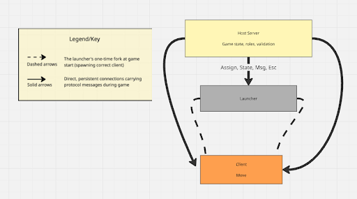

# a-mogus - A terminal game inspired by amongus

## Final documentation

**1\. Brief project overview and target use-case**

Our goal with this project was originally to recreate the game among us but in terminal form. Among Us is a social deduction game where players work together to complete tasks on a spaceship while one or more impostors secretly sabotage their efforts. Our terminal-based implementation brings this experience to a distributed network setting, where players connect from separate computers over a shared network. The target users are small groups of friends or students who want a lightweight, no-install game experience over a local network or internet tunnel. However as we discovered throughout the project, game development is really hard. Most of us had not previously taken a course in game development, so going trying to figure out game loops and all the network related issues was proving to be too much within the given project timeline. This made us seriously shrink down our game to just have a round based moving game.

**Final architecture diagram showing all components and connections**



**Protocol summary (message types, flow, and key scenarios)**

Message: CONNECT

Description: Initiates a player's connection to the game lobby. Must be the first message sent by a client after establishing a TCP connection.Sender: Client → Server

Fields: None

Response:

- Success: Server replies with ASSIGN containing the player's assigned color and role
- Failure: ERROR lobby is full if all color slots are taken; ERROR invalid first message if any other message is sent first

Side Effects:

Server reserves a color for the connecting player and adds them to the player registry

Server begins waiting for MIN_PLAYERS to connect before proceeding

Example:

python3 launcher.py

---

Message: ASSIGN

Description: Sent by the server to inform a player of their assigned color and role after enough players have joined the lobby. Sender: Server → Client

Fields:

- color (string, required) — the unique color identifier assigned to this player (e.g. red, blue)
- role (string, required) — either crew or imposter

Response: Client is expected to reply with CONFIRMROLE

Side Effects:

- Exactly one player per lobby is assigned imposter; all others receive crew
- Role assignment happens once the first thread to run detects MIN_PLAYERS connected players

Example:

ASSIGN color=red role=crew

---

Message: CONFIRMROLE

Description: Sent by the client to acknowledge and confirm the color and role they were assigned. Sender: Client → Server

Fields:

- color (string, required) — must match the color from the preceding ASSIGN
- role (string, required) — must match the role from the preceding ASSIGN

Response:

- Success: WAIT — server acknowledges and instructs the client to hold until all players confirm
- Failure: ERROR confirmrole mismatch if either field doesn't match what the server assigned; ERROR expected CONFIRMROLE if the message format is wrong entirely

Side Effects:

- Marks the player as confirmed in the server's game state
- Once all connected players have confirmed, the server proceeds to start the game

Example:

CONFIRMROLE color=red role=crew

---

Message: WAIT

Description: Sent by the server after a player's role is confirmed. Tells the client to hold until all players are ready and the game is about to begin. Sender: Server → Client

Fields: None

Response: None expected from client. Client should then listen for the game start MSG broadcast.

Side Effects: None directly — once the last player receives WAIT, the server broadcasts the start message to everyone

Example:

Round 2 | You (purple) are in: HALLWAY

0\. Stay here (WAIT)

1\. Move to cafeteria

2\. Move to reactor

3\. Move to medbay

Your move: 0

---

Message: MOVE

Description: Allows a player to move into an adjacent room during their turn. Sent in response to a STATE message.

Sender: Client → Server

Fields:

- target_room (int, required) — number of room you are trying to go to

Response:

- Success: Player's movement is included in the next ROUND_RESULT broadcast as {color} moved to {target}
- Failure: If the target room is not adjacent to the player's current room or doesn't exist, the move is silently rejected and ROUND_RESULT reflects {color} stayed in {current_room} instead.

Side Effects:

- On success, updates the player's current room in the server's game state
- On failure, player's room is unchanged

Example:

Round 2 | You (purple) are in: HALLWAY

0\. Stay here (WAIT)

1\. Move to cafeteria

2\. Move to reactor

3\. Move to medbay

Your move: 1

**Failure/error handling approach (timeouts, duplicates, crash recovery, ordering, etc.)**

Our play testing involved mimicking having users specifically input the wrong inputs to see how our game would react. From these interactions we tried to put in try/except clauses that would catch errors where they occurred rather than have an error just show up and say nothing. Additionally we tried to include text in the except block that would inform us what error was occurring and where it was occurring in the code.

**Testing and validation summary (how you verified behavior)**

In order to verify behavior we tried to continuously test it throughout the development. Our validation summary included the ability to connect 3 players to the game, and assign them roles (even though we don’t end up using the roles). Next we tested the round game mechanic to make sure that it was functioning correctly, and after that the move ability. We also ran into issues when we began using subprocesses.Popen() where the code would run on MacOs devices but not on a Windows computer due to the difference between how they handled sockets. Because of that, we ensured that we tested the game on both devices each time.

**Short summary of changes from the initial proposal**

Our initial proposal was very optimistic, and we had to reduce our goals for the game significantly. We cut out a lot of the actions that we originally intended to implement and are part of the actual among us game like sabotage, task, kill and emergency meeting. The game still initiates an imposter and crew members, but they have no meaning in the current rendition of the game. What we did implement is a map and the ability to move within the map as well as the game logic that is required for that.

## Message Types

- [CONNECT](#connect)
- [ASSIGN](#assign)
- [CONFIRMROLE](#confirmrole)
- [STATE](#state)
- [MOVE](#move)
- [TASK](#task)
- [KILL](#kill)
- [SABOTAGE](#sabotage)
- [EMERGENCY](#emergency)
- [WAIT](#wait)
- [VOTE](#vote)
- [VOTE_RESPONSE](#vote_response)
- [ROUND_END](#round_end)
- [ROUND_RESULT](#round_result)
- [VOTE_RESULT](#vote_result)
- [DEAD](#dead)
- [MSG](#msg)

---

## CONNECT

**Description:** Client sends connect message to game server and registers username.

**Sender:** Client → Server

**Fields:**

- NONE

**Response:**

- ASSIGN or ERROR if the lobby for the game is full or already started

**Side Effects:**

- Server generates a random color for the player and assigns it for them; server puts the player into a game and the player count for that game increases

**Example:**

```
ASSIGN or ERROR Message
```

---

## ASSIGN

**Description:** Server receives Connect message from client and sends back color they are and role they are assigned.

**Sender:** Server → Client

**Fields:**

- color (string, required) – color that the player gets assigned
- role (string, required) – "crew" or "imposter"

**Response:**

- CONFIRM ROLE

**Side Effects:**

- Client stores their color and role locally

**Example:**

```
ASSIGN username = red, role = crew
```

---

## CONRIM ROLE

**Description:** Client acknowledges they got their assigned role.

**Sender:** Client → Server

**Fields:**

- color (string, required) – sends back color that they were assigned to
- role (string, required) – sends back role they got assigned to "crew" or "imposter"

**Response:**

- WAIT

**Side Effects:**

- Server checks color and role for accuracy

**Example:**

```
CONRIM ROLE username = red, role = crew
```

---

## STATE

**Description:** Sent by the Server which lets all clients know the current game state (very large message).

**Sender:** Server → Client

**Fields:**

- color (string, required) – the player that the STATE message goes to
- game_status (string, required) – "active", "in meeting", "game end"
- current_room (string, required) – room that the player is in
- remaining_tasks (int, required) – number of tasks left to do
- player_status (bool, required) – 0 or 1 if the player is alive or dead
- player_in_room (array of string, required) color of all players in the same room, imposter gets sent every person in every room
- game_over (string, optional) – if game_status is 0 has if crew or imposter sends game over message with corresponding win or lose depending on crew or imposter of player

**Response:**

- NONE

**Side Effects:**

- Client updates game status

**Example:**

```
STATE username = red, game_status = active, current_room = lab, player_status = alive, player_in_room = yellow
```

---

## MOVE

**Description:** Allows a player to move into an adjacent room.

**Sender:** Client → Server

**Fields:**

- room id (string, required)

**Response:**

- Success: If player successfully moves into the desired room.
- Failure: A message displaying that the player cannot move because there was an error in the formatting of the message or an invalid room (not adjacent or non existent) was given

**Side Effects:**

- Changes game state on server. Reflects that a player is now in the desired room

**Example:**

```
MOVE room_a
```

---

## TASK

**Description:** Player submits a response to a task prompt.

**Sender:** Client → Server

**Fields:**

- task_id (String, required)
- response (String, required)

**Response:**

- Correct: If given response matches expected response from server.
- Incorrect: If given response does not match expected response from server.

**Side Effects:**

- If a correct response is given the game state will reflect this by showing that the player that completed the tasks has completed it and has X amount to go. If the response has the incorrect answer then there will be no change to game state.

**Example:**

```
TASK task_1 "this is a response to the question"
```

---

## KILL

**Description:** Allows an imposter player to kill.

**Sender:** Client → Server

**Fields:**

- player_id (String, required)

**Response:**

- Success: Player was successful killed
- Failure: Player was not successfully killed due to them moving out of the room or other errors related to server synchronization issues or incorrect formatting from sender.

**Side Effects:**

- If a crewmate is successfully killed, the game state will reflect this by changing their status to dead. The crewmate loses the ability to participate in the game as a crewmate and will observe as a ghost. A failure will not result in any game state changes.

**Example:**

```
KILL player_1
```

---

## SABOTAGE

**Description:** Allows the impostor to activate one of their sabotage charges to disrupt crewmates.

**Sender:** Client → Server

**Fields:**

- type (string, required) – flood, drop, or glitch
- target (string, optional) – specific crewmate username, used only with glitch

**Response:**

- SUCCESS – sabotage was successfully applied
- FAILURE – no sabotage charges remaining or invalid type

**Side Effects:**

- flood resets all in-progress crewmate tasks. drop suppresses the next EMERGENCY message. glitch teleports all crewmates to random rooms, or one specific crewmate if target is provided. Decrements the impostor's sabotage count by 1.

**Example:**

```
SABOTAGE type=glitch target=yellow
```

---

## EMERGENCY

**Description:** Allows a crew mate to call an emergency meeting once seeing a dead player in a room they have entered.

**Sender:** Client → Server

**Fields:**

- None

**Response:**

- Success: Emergency meeting successfully called

**Side Effects:**

- The current round will end immediately and this will reflect in the game state. All task prompts and other options will not be available to players.

**Example:**

```
EMERGENCY
```

---

## WAIT

**Description:** Player takes no action on their turn and chooses to wait.

**Sender:** Client → Server

**Fields:**

- NONE

**Response:**

- NONE, Client waits to receive STATE or VOTE

**Side Effects:**

- Server updates that this player chose to wait

**Example:**

```
WAIT
```

---

## VOTE

**Description:** Server prompts player to vote then client votes on choice.

**Sender:** Server → Client, Client → Server

**Fields (Server → Client):**

- player_options (array of strings, required) – all colors of player available to vote on

**Response:**

- VOTE_RESPONSE

**Side Effects:**

- When received all players votes counts them and kills the person with the most amount of votes

**Example:**

```
VOTE player_options for vote [red, yellow, black, green]
```

---

## VOTE_RESPONSE

**Description:** Client sends back their choice for the vote.

**Sender:** Client → Server

**Fields:**

- player_voted (string, required) – name of the color the player chose to eliminate

**Response:**

- VOTE_RESULT

**Side Effects:**

- Game state update with dead player and goes on to increment round

**Example:**

```
VOTE_RESPONSE player_voted = yellow
```

---

## ROUND_END

**Description:** Server signals that the submission window for the current round closed.

**Sender:** Server → Clients

**Fields:**

- round (int, required)

**Response:**

- None.

**Side Effects:**

- The server begins the resolution phase. Any player who did not submit an action is treated as having submitted WAIT.

**Example:**

```
ROUND_END round=4
```

---

## ROUND_RESULT

**Description:** Server broadcasts the outcome of all resolved actions for the round.

**Sender:** Server → Clients

**Fields:**

- round (int, required)
- events (list of event strings [separated by semi-colons?], required - who moved where, whether a kill succeeded, tasks completed, etc.)

**Response:**

- None. Server broadcasts STATE for the next protocol.

**Side Effects:**

- Client prints the event log to the terminal. If a death occurred, the server marks that player as dead before the next STATE is sent.

**Example:**

```
ROUND_RESULT round=4 events=yellow moved to cafeteria;red completed fix_wiring;blue was killed by impostor
```

---

## VOTE_RESULT

**Description:** Server broadcasts the outcome of a meeting vote to all players.

**Sender:** Server → Clients

**Fields:**

- ejected (string) - username of the ejected player OR 'nobody' if no one is ejected
- was_imposter (boolean)
- round (int, required)

**Response:**

- None. Server transitions back to active and sends next STATE

**Side Effects:**

- Ejected player is marked as dead. Server checks win condition. Game resumes next round.

**Example:**

```
VOTE_RESULT round=5 ejected=yellow was_impostor=true
```

---

## DEAD

**Description:** Server notifies all players that a player has died or been ejected.

**Sender:** Server → Clients

**Fields:**

- username (string, required)
- cause (string: killed OR ejected)

**Response:**

- None.

**Side Effects:**

- The server marks the player as dead. The dead player's client transitions into spectator mode (disabling player input). If a body is in a shared room, the server auto-triggers a meeting next round

**Example:**

```
DEAD username=yellow cause=killed
```

---

## MSG

**Description:** Server sends a plain-text notification to a specific client or all clients.

**Sender:** Server → Crewmate/Imposter

**Fields:**

- text (string, required)

**Response:**

- None.

**Side Effects:**

- Client prints message to terminal

**Example:**

```
MSG text=The_imposter_has_used_their_last_sabotage.\
```
